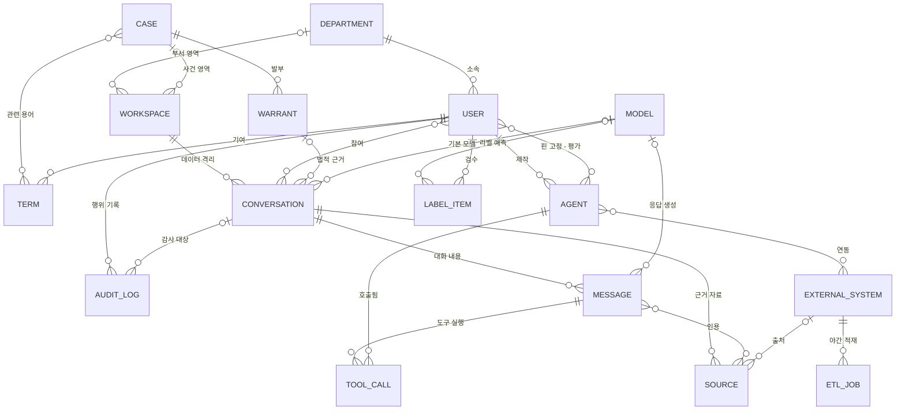
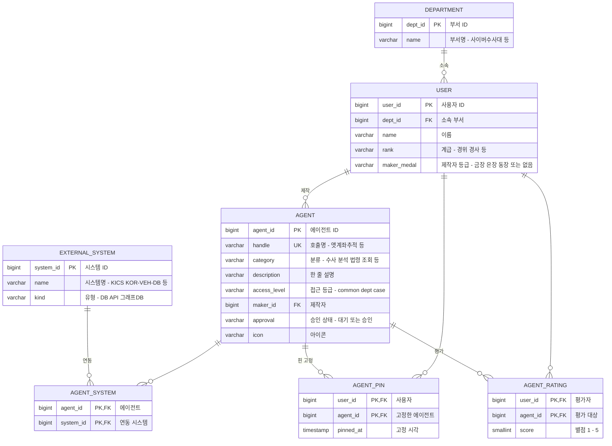
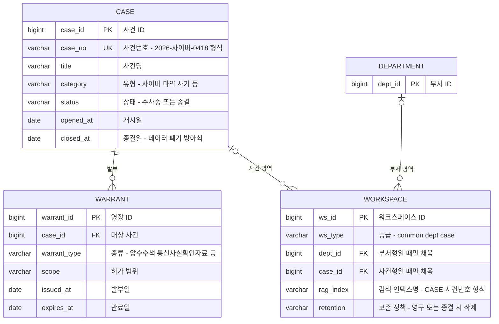
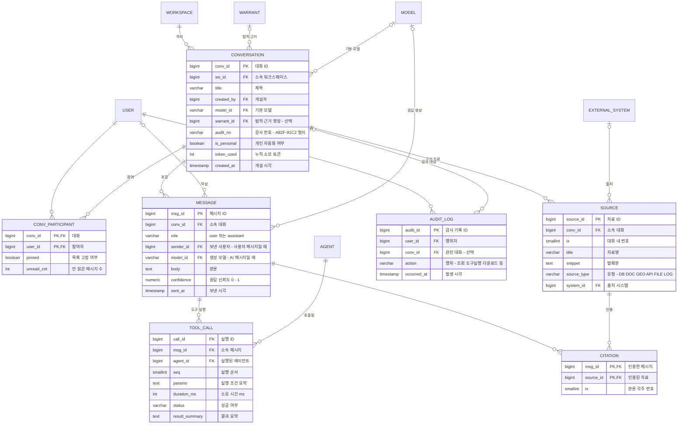
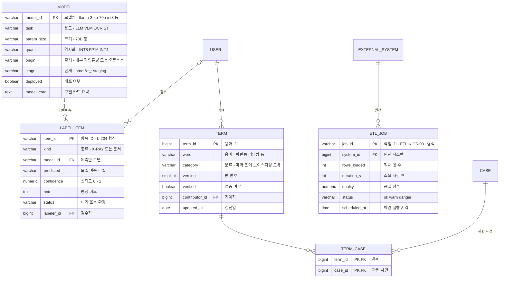

# Project Aegis 데이터 모델 · ERD

> [Project-Aegis](https://github.com/ChaYujin-kr/Project-Aegis)는 경찰 수사 업무용 AI 통합 플랫폼의 개념 검증(PoC) 데모입니다.
> 저장소에는 서버·데이터베이스 코드가 없고 화면과 화면용 모의 데이터만 있으므로, 그 데이터 구조를 근거로
> **이 화면들을 실제 서비스로 만들 때 필요한 관계형 데이터베이스 스키마**를 역으로 설계했습니다.
> 아래 개체-관계도(ERD, 테이블과 테이블 사이의 관계를 그린 그림)가 그 결과입니다.

- 테이블 **22개** (연결 테이블 6개 포함) · 업무 영역 **4개** · 데이터 접근 등급 **3단계**
- 스타일이 입혀진 문서판: [`docs/erd.html`](./erd.html) (내려받아 브라우저로 열기)

---

## 1. 무엇을 다루는 시스템인가

화면들을 훑어 보면 이 플랫폼은 크게 세 덩어리입니다.

- **AI 대화 콘솔** — 수사관이 AI와 대화하며 차량 조회, 통화 기록 분석, 영장 초안 작성 같은 업무를 처리합니다.
  AI 응답마다 근거 자료가 각주로 붙고, 모든 대화에 감사 번호가 찍힙니다.
  (근거: `project-Aegis/assets/conversations.js`, `project-Aegis/platform/chat.jsx`)
- **에이전트 스토어** — 직원들이 만든 업무 자동화 도구(에이전트)를 등록·공유하고,
  호출 수·별점·제작자 등급(금장/은장/동장)으로 순위를 매깁니다. (근거: `project-Aegis/platform/store.jsx`)
- **데이터 관리 콘솔(MLOps)** — 수사 은어 사전, 사람이 검수하는 라벨링 대기열, 야간 데이터 적재 작업 현황,
  AI 모델 목록을 관리합니다. (근거: `project-Aegis/platform/mlops.jsx`)

설계 전체를 관통하는 규칙이 하나 있습니다. 모든 데이터가 **세 단계 접근 등급** 중 하나에 속한다는 것입니다.
대화가 열리는 워크스페이스(작업 공간)도, 에이전트의 공개 범위도 같은 등급 체계를 씁니다.
(근거: `chat.jsx:16-41`, `store.jsx:20-24`)

| 등급 | 의미 |
|---|---|
| 🔵 공통 (common) | 법령·매뉴얼, 전 직원 열람 |
| 🟠 부서 (dept) | 부서 사례, 자동 가명 처리 |
| 🔴 사건 (case) | 원본 증거, 사건 종결 시 즉시 삭제 |

---

## 2. 전체 구조 한눈에 보기

22개 테이블을 한 장에 그리면 선이 얽혀 읽기 어려우므로, 이 그림에서는 다대다 관계(양쪽 다 여러 개씩
연결되는 관계)를 한 줄로 줄여 16개 개체만 표시했습니다. 다대다를 실제 테이블로 푸는 방법은
3장의 영역별 상세도에 있습니다.

**까마귀발 표기 읽는 법** — 선 끝 모양이 개수를 뜻합니다.
`||` 정확히 1개 · `|o` 0개 또는 1개 · `o{` 0개 이상 여러 개.
예: 부서 `||—o{` 사용자 = "사용자는 부서 1곳에 소속, 부서에는 사용자가 여러 명".

다대다 관계 5곳(참여, 인용, 핀 고정·평가, 연동, 관련 용어)은 상세도에서
연결 테이블(두 테이블의 ID를 쌍으로 갖는 중간 테이블)로 풀립니다.

---

## 3. 영역별 상세 설계

### 3-A. 사람 · 조직 · 에이전트 스토어

출발점은 사람입니다. 사용자는 부서에 소속되고 → 사용자가 에이전트를 만들어 등록하고 →
다른 사용자들이 그 에이전트를 핀으로 고정하거나 별점을 매깁니다. 화면의 "호출 4,821회 · 별점 4.9"
같은 숫자는 저장된 값이 아니라 아래 테이블에서 집계한 결과로 설계했습니다(이유는 5장 설계 노트 참고).
에이전트가 실제로 어떤 외부 시스템(경찰 차량 DB, KICS 등)을 호출하는지는 연결 테이블
`AGENT_SYSTEM`이 기록합니다.

근거: `store.jsx:5-18` (에이전트 12종), `store.jsx:20-30` (등급·메달 체계), `conversations.js:11-15` (에이전트-시스템 연동)

### 3-B. 사건 · 영장 · 워크스페이스

수사 데이터의 법적 뼈대입니다. 사건이 있고 → 사건에 영장이 발부되며(만료일 포함) →
대화가 열리는 워크스페이스가 등급에 따라 부서 또는 사건에 연결됩니다. 사건 등급 워크스페이스는
"사건 종결 시 즉시 삭제"가 규칙이므로, 사건 테이블의 종결일(`closed_at`)이 곧 데이터 폐기의
방아쇠가 됩니다.

근거: `chat.jsx:16-41` (3단계 워크스페이스), `conversations.js:48` (영장 만료일), `chat.jsx:36` (종결 시 자동 폐기)

### 3-C. 대화 · 메시지 · 감사 추적

플랫폼의 심장부라 테이블이 가장 많습니다. 논리를 한 단계씩 따라가면 이렇습니다.
대화는 반드시 워크스페이스 하나에 속한다(격리) → 대화에는 여러 명이 참여한다(연결 테이블
`CONV_PARTICIPANT`, 핀 고정·안 읽은 개수는 사람마다 다르므로 여기에 둔다) → 대화 안에 메시지가
쌓인다 → AI 메시지는 도구(에이전트)를 실행한 기록(`TOOL_CALL`)을 남긴다 → AI가 답의 근거로 쓴
자료는 대화에 `SOURCE`로 붙고, 메시지 본문의 각주 [1][2]는 `CITATION`이 메시지와 자료를 짝지어
만든다 → 이 모든 행위가 `AUDIT_LOG`(감사 기록)에 남는다.

속성이 없는 상자(`USER`, `MODEL` 등)는 다른 영역에서 정의된 테이블입니다.
근거: `conversations.js:7-49` (대화 전체 구조), `conversations.js:38-47` (각주-자료 짝),
`chat.jsx:482-490` (감사 번호·토큰), `chat.jsx:375-379` (참여자)

### 3-D. 데이터 거버넌스 · MLOps

데이터 관리 콘솔의 네 화면이 그대로 네 테이블이 됩니다. 은어 사전의 용어는 실제 사건과
연결되고("파란콩" → 2026-마약-0202) → 라벨링 대기열의 항목은 어떤 모델이 예측했고 누가
검수하는지를 가리키며 → 야간 적재 작업은 원천 시스템을, 모델 목록은 대화·메시지·라벨링이
참조하는 모델 원장을 이룹니다.

근거: `mlops.jsx:8-16` (용어), `mlops.jsx:100-104` (용어-사건 연결), `mlops.jsx:121-127` (라벨링),
`mlops.jsx:246-254` (야간 적재), `mlops.jsx:355-362` (모델 목록)

---

## 4. 테이블 요약표

22개 테이블의 역할과, 각 테이블을 어떤 원본 코드에서 도출했는지의 대응표입니다.
파일 경로는 저장소의 `project-Aegis/` 폴더 기준입니다.

| 테이블 | 역할 | 설계 근거 (파일:줄) |
|---|---|---|
| **사람 · 조직 · 에이전트** | | |
| `DEPARTMENT` | 부서 (사이버수사대, 법무행정과 등) | `store.jsx:6-17` |
| `USER` | 사용자(경찰관) — 계급, 소속, 제작자 등급 | `conversations.js:18` · `store.jsx:6` |
| `AGENT` | 업무 자동화 에이전트 — 접근 등급, 제작자, 승인 상태 | `store.jsx:5-18` |
| `EXTERNAL_SYSTEM` | 연동 외부 시스템 (KICS, 차량 DB, Neo4j 등) | `conversations.js:16` · `mlops.jsx:247-253` |
| `AGENT_SYSTEM` | 연결: 에이전트 ↔ 외부 시스템 | `conversations.js:11-15` |
| `AGENT_PIN` | 연결: 사용자의 에이전트 핀 고정 | `store.jsx:6` (pinned) |
| `AGENT_RATING` | 연결: 사용자의 에이전트 별점 (화면의 4.9는 평균값) | `store.jsx:6` (rating) |
| **사건 · 법적 근거** | | |
| `CASE` | 사건 — 사건번호, 유형, 상태, 종결일(폐기 방아쇠) | `conversations.js:9` · `mlops.jsx:100-104` |
| `WARRANT` | 영장 — 종류, 허가 범위, 만료일 | `conversations.js:48, 95` |
| `WORKSPACE` | 작업 공간 — 3단계 등급, 검색 인덱스, 보존 정책 | `chat.jsx:16-41` |
| **대화 · 메시지 · 감사** | | |
| `CONVERSATION` | 대화 — 워크스페이스 소속, 감사 번호, 기본 모델, 영장 | `conversations.js:7-10` · `chat.jsx:6-14` |
| `CONV_PARTICIPANT` | 연결: 대화 참여자 — 사람별 핀·안 읽은 수 | `chat.jsx:375-379` |
| `MESSAGE` | 메시지 — 사용자/AI 구분, 본문, 신뢰도 | `conversations.js:17-43` |
| `TOOL_CALL` | 메시지 안의 에이전트 실행 기록 — 소요 시간, 결과 | `conversations.js:23-25, 363-371` |
| `SOURCE` | 대화에 첨부된 근거 자료 — 유형, 발췌, 출처 시스템 | `conversations.js:44-47` |
| `CITATION` | 연결: 메시지 각주 [1][2] ↔ 근거 자료 | `conversations.js:38-41` |
| `AUDIT_LOG` | 감사 기록 — 누가 언제 무엇을 했는지 전부 기록 | `conversations.js:9` · `chat.jsx:482-490` |
| **데이터 거버넌스 · MLOps** | | |
| `MODEL` | AI 모델 원장 — 용도, 양자화, 배포 단계 | `mlops.jsx:355-362` |
| `TERM` | 수사 은어·용어 사전 — 판 번호, 검증 여부, 기여자 | `mlops.jsx:8-15` |
| `TERM_CASE` | 연결: 용어 ↔ 관련 사건 | `mlops.jsx:100-104` |
| `LABEL_ITEM` | 사람 검수(HITL) 라벨링 대기열 — 예측 라벨, 신뢰도 | `mlops.jsx:121-127` |
| `ETL_JOB` | 야간 데이터 적재 작업 — 행 수, 품질 점수, 상태 | `mlops.jsx:246-254` |

---

## 5. 설계 노트 — 왜 이렇게 만들었나

- **화면 역설계라는 전제.** 저장소에는 실제 서버·DB가 없다 → 화면에 박힌 모의 데이터가 유일한
  근거다 → 따라서 이 ERD는 "이 화면들을 실제로 돌리는 데 필요한 최소한의 스키마"이며, 화면에
  없는 기능(권한 상세, 결재선 등)은 넣지 않았습니다.
- **집계 값은 저장하지 않는다.** 화면의 "호출 4,821회 · 별점 4.9 · 인용 14회"를 그대로 컬럼에
  저장하면 → 원본 기록(도구 실행, 별점)과 어긋날 수 있다 → 그래서 `TOOL_CALL` 개수,
  `AGENT_RATING` 평균처럼 원본에서 계산하는 파생 값으로 설계했습니다. 속도가 필요하면 캐시
  컬럼을 추가하되 원장은 항상 기록 테이블입니다.
- **사건 종결 = 데이터 폐기.** 사건 등급 워크스페이스는 "종결 시 인덱스·임베딩·캐시 전부 자동
  폐기"가 요구사항이다(`chat.jsx:36`) → `CASE.closed_at`이 기록되면 → 그 사건에 연결된
  워크스페이스 → 대화 → 메시지·근거 자료가 연쇄 삭제(FK의 ON DELETE CASCADE)되고, 검색
  인덱스(`rag_index`)도 함께 폐기하는 배치가 돌아야 합니다. 단, `AUDIT_LOG`는 감사 목적상 삭제
  대상에서 제외합니다.
- **접근 등급은 한 곳에서.** 워크스페이스의 `ws_type`과 에이전트의 `access_level`이 같은 3단계
  등급(공통/부서/사건)을 쓴다 → 값을 각자 자유 문자열로 두면 어긋난다 → 실제 구현에서는 ENUM
  타입이나 공용 코드 테이블 하나로 관리해야 합니다.
- **그래프 데이터는 ERD 밖.** 통화 관계망, 위협-인물-사건 그래프(`chat.jsx:228-241`)는 관계형
  테이블이 아니라 그래프 DB(Neo4j)에 저장되는 별도 영역이다 → 여기서는
  `EXTERNAL_SYSTEM`("Neo4j neo-cdr")으로 연결 지점만 남겼습니다.
- **메시지 본문 단순화.** 데모에서는 본문이 표·이미지가 섞인 HTML 문자열이다 → 실제 서비스라면
  첨부파일 테이블(ATTACHMENT)을 분리해야 하지만, 데모 충실도 기준으로 `body` 하나로 두었습니다.

---

*영문판(`*_eng`) 파일은 한국어판과 구조가 동일하여 `project-Aegis/` 폴더 기준으로 분석 · 2026-08 작성*
